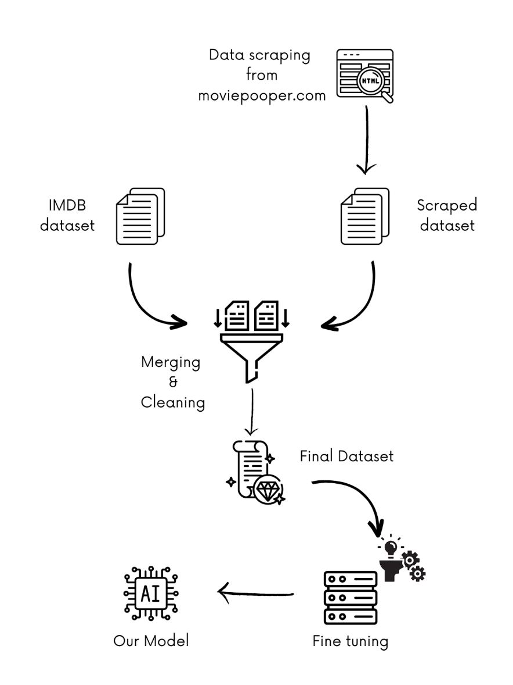

# SpoilMe

As part of my project, I developed artificial intelligence that aims to predict the likely ending of a movie in a human-like manner. My goal was to create a model that could provide answers in the form of a sentence, imitating the way I think and speak.

To achieve this goal, I used the GPT-3 artificial intelligence model, a trendy technology, and adapted it to my needs using a fine-tuning technique. I fed this model a database of over 1000 sets containing movie synopses and key plot elements, which are not revealed in the synopsis itself (spoilers). This approach allowed me to adapt and develop logic specific to my purpose. After training my model and running tests on 300 new abstracts, I found a success rate of 12%. This means that in 12% of cases, my AI was able to predict an actual key event in the movie's plot. This project opens up interesting perspectives by allowing a machine to respond and provide answers similar to those of a human in the field of predicting the end of a movie. Although my current success rate can be improved, it demonstrates the capabilities of the GPT-3 model to understand data and generate relevant answers. I continue to work on this project, exploring potential improvements to increase the accuracy of my predictions. My goal is to develop even better artificial intelligence to analyze synopses and offer captivating answers, thus igniting the excitement of movie lovers who want to discover the exciting plots behind each synopsis.

## App Picture

## Workflow to create the model

